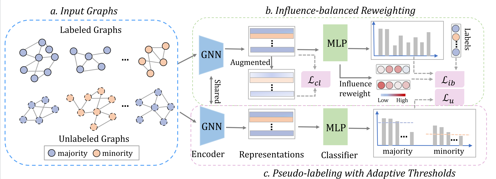

# IRIS
This repository provides official codes for "IRIS: Influence-Balanced Reweighting and Imbalance-Aware Pseudo-Labeling for Semi-Supervised Graph Classification".
## Overview 


## Requirements

* numpy
* pandas
* sklearn
* networkx
* pytorch
* torch_geometric

## Implementation
```
./run.sh 
```
